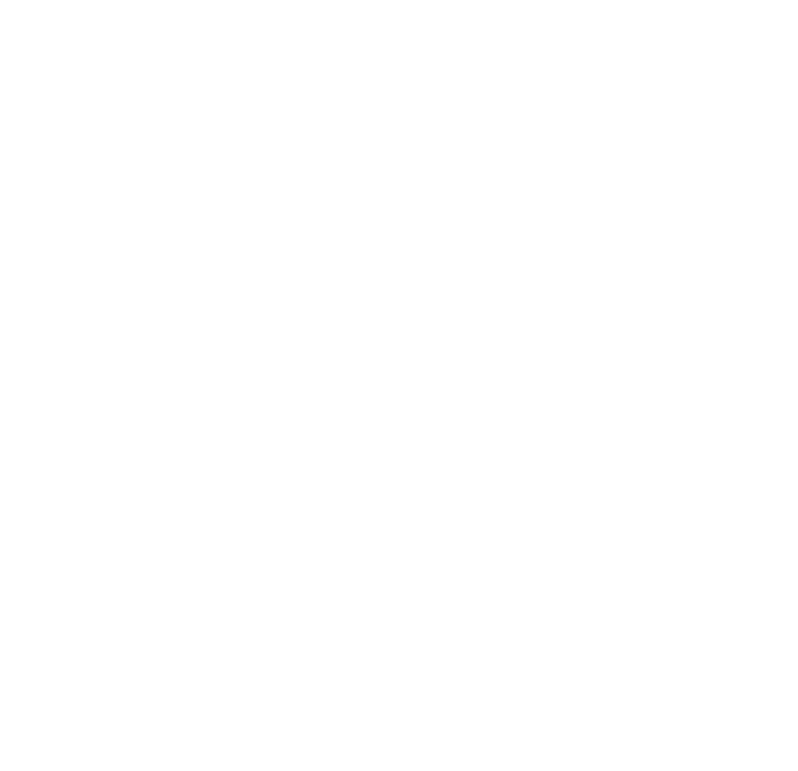

# JINHONG (WZJH) Design System

**Wenzhou Jinhong Electric Co., Ltd.** · 温州金宏电器有限公司 · <https://www.wzjh.cc>
Brand: **JINHONG** · Wordmark: **ZJWZJH** · Version **1.0.0**

> **Purpose.** This is the single source of truth for building on-brand **websites and
> presentations** for JINHONG. Paste it (or its URL) into any AI tool — Claude, ChatGPT,
> Gemini, Cursor, v0 — as context. Every rule is unambiguous and copy‑paste ready.
> Pair it with [`tokens/wzjh-tokens.css`](tokens/wzjh-tokens.css) (variables) and
> [`wzjh.css`](wzjh.css) (component classes). For strict generation guardrails see
> [`FOR-AI.md`](FOR-AI.md); for slide decks see [`FOR-PRESENTATIONS.md`](FOR-PRESENTATIONS.md).

**How keywords are used below:** `MUST` / `MUST NOT` / `NEVER` = absolute; `SHOULD` =
strong default; `MAY` = allowed. (RFC 2119.)

---

## 0 · Quick start (the 30‑second contract)

```html
<!doctype html>
<html lang="en"><head>
  <meta charset="utf-8">
  <meta name="viewport" content="width=device-width, initial-scale=1">
  <title>JINHONG · Page title</title>
  <link rel="icon" href="assets/favicon.svg">
  <!-- 1) tokens (variables)  2) components (classes). Always in this order. -->
  <link rel="stylesheet" href="tokens/wzjh-tokens.css">
  <link rel="stylesheet" href="wzjh.css">
</head><body>
  <!-- build with .wzjh-* classes and var(--wzjh-*) tokens only -->
</body></html>
```

You may also **inline** the contents of both CSS files into a single `<style>` block (use
this for one‑file deliverables and slide decks). Do not alter the values.

**Six rules that prevent 90% of off‑brand output:**
1. Colors, sizes, spacing, radii **MUST** come from the tokens. Never invent a hex or a px.
2. Brand blue `#0BA1E2` is **decorative only**. For text/links/buttons use `--wzjh-action` (`#0A6FB0`).
3. Body text is `--wzjh-text` (`#2F2725`) on `--wzjh-surface` (white). Headings weight 700.
4. Layout in `rem`; `px` allowed **only** for 1px hairline borders.
5. Real product photography or defined placeholders — **NEVER** invent/redraw products, logos, or certifications.
6. Industrial restraint: white + light‑gray bands, sharp corners, one accent. No SaaS gradients, blobs, or pill buttons.

---

## 1 · SYSTEM DIRECTIVES (non‑negotiable)

- D1. You **MUST** link or inline `tokens/wzjh-tokens.css` before any custom CSS.
- D2. You **MUST NOT** write raw hex/rgb/hsl in component CSS. Reference `var(--wzjh-*)`.
- D3. You **MUST** use the type scale in §4. You **MUST NOT** invent font sizes (no 13px, 15px, 17px, 19px, 22px, 28px…).
- D4. You **MUST** use the font stack `var(--wzjh-font-sans)`. You **MUST NOT** `@import` Google Fonts or set a different family unless the user explicitly asks.
- D5. `#0BA1E2` and `#35A3D9` **MUST NOT** be used for body text, links, or small labels on white (they fail WCAG). Use `--wzjh-action`.
- D6. Every interactive element **MUST** have a visible `:focus-visible` state and a hit target ≥ `--wzjh-touch-min` (44px).
- D7. Every page **MUST** support English and Simplified Chinese without overflow or clipping; **NEVER** shrink Chinese to fit.
- D8. Industrial red `--wzjh-danger` (`#A3201A`) is for danger/e‑stop/errors **only** — never decoration or promos.
- D9. Dark mode is **not supported** for websites. The page is light. (Decks have a dark title‑slide variant only.)
- D10. If a value you need is not in this document, **ask before inventing it** — the tokens are exhaustive.

---

## 2 · Brand foundations

- **Company:** Wenzhou Jinhong Electric Co., Ltd. (温州金宏电器有限公司).
- **Brand name (copy):** **JINHONG** — all caps in body copy. Never "Jinhong" / "jinhong".
- **Wordmark (logo):** **ZJWZJH** — used as the visual logo only (see §13). Don't typeset "ZJWZJH" as running text.
- **What they make:** mid‑to‑high‑end industrial electrical control components — metal & plastic
  pushbutton switches, indicator/signal lights, tower (stack) lights, relays & relay sockets,
  relay interface modules, cam switches, isolator switches, fuse holders, foot/palm switches,
  battery‑free **wireless (energy‑harvesting) switches**, and enclosures.
- **Markets:** elevators, industrial robotics, petrochemical, CNC machining, automotive, food/packaging.
- **Positioning:** rugged · vandal‑resistant · reliable · precision‑engineered · IoT‑forward.
- **Personality:** authoritative, precise, plain‑spoken. Data over adjectives. No hype, no exclamation marks.
- **Languages:** English + Simplified Chinese are first‑class. (Site also offers DE/FR/ES.)

---

## 3 · Color tokens

Reference colors by **token name**, never by hex. Hex is shown for lookup only. All contrast
ratios are measured against the intended background (verified, WCAG 2.2).

### 3.1 Blue — one coherent ramp

| Token (CSS var) | Hex | On‑white | Use for |
|---|---|---|---|
| `--wzjh-blue-50` | `#EAF6FC` | — | tinted section band, selected row |
| `--wzjh-blue-100` | `#CFEAF8` | — | light fill, info box, hover bg |
| `--wzjh-blue-300` | `#5FC0EA` | — | decorative; footer link hover on dark |
| `--wzjh-blue-400` *(accent)* | `#35A3D9` | 2.84 ❌ | **decorative only** (authentic secondary). Not text. |
| `--wzjh-blue-500` *(BRAND)* | `#0BA1E2` | 2.91 ❌ | logo, large fills, icon strokes, big graphics. **Not text.** |
| `--wzjh-blue-600` | `#0E86C0` | 4.05 | fill hover; large (≥24px) text/UI only |
| `--wzjh-blue-700` *(ACTION)* | `#0A6FB0` | **5.37 ✅** | **links, buttons, small text** — the everyday blue |
| `--wzjh-blue-800` | `#0A5680` | 7.91 ✅ | action hover, high‑contrast text |
| `--wzjh-blue-900` *(navy)* | `#103D5B` | 11.41 ✅ | dark sections, footer, deep headings |

> **The single most important rule:** the signature blue `#0BA1E2` is gorgeous as a *fill*,
> *stroke*, or *logo* — but at 2.91:1 it is invisible-grade for text. Any link or button label
> in `#0BA1E2` is a defect. Use `--wzjh-action` (`#0A6FB0`).

### 3.2 Ink & neutrals (warm, tuned to the charcoal ink)

| Token | Hex | On‑white | Use for |
|---|---|---|---|
| `--wzjh-ink-900` → `--wzjh-text` | `#2F2725` | 14.61 ✅ | primary text, headings |
| `--wzjh-neutral-700` → `--wzjh-text-secondary` | `#555555` | 7.46 ✅ | secondary text |
| `--wzjh-neutral-600` → `--wzjh-text-muted` | `#6B6B6B` | 5.33 ✅ | captions, metadata |
| `--wzjh-neutral-500` → `--wzjh-text-disabled` | `#898989` | 3.50 ❌ | placeholder/disabled/decorative — **not body text** |
| `--wzjh-neutral-300` → `--wzjh-border` | `#DDDDDD` | — | default borders |
| `--wzjh-neutral-150` → `--wzjh-border-subtle` | `#EEEEEE` | — | hairlines, dividers |
| `--wzjh-neutral-50` → `--wzjh-surface-subtle` | `#F7F7F7` | — | section bands |
| `--wzjh-white` → `--wzjh-surface` | `#FFFFFF` | — | page & card surface |

### 3.3 Status (each pair is contrast‑checked)

| Semantic | Solid / text | Hex | Background tint | Use for |
|---|---|---|---|---|
| `--wzjh-danger` | text/badge | `#A3201A` (7.56 ✅) | `--wzjh-danger-bg` `#FBEAE9` | errors, e‑stop, destructive |
| `--wzjh-success` | text | `#157A41` (5.40 ✅) | `--wzjh-success-bg` `#E7F4ED` | operational, in‑stock, pass |
| `--wzjh-warning` | text | `#8A5200` (6.39 ✅) | `--wzjh-warning-bg` `#FCF3E2` | caution, tolerance limits |
| `--wzjh-info` | text | `#0A6FB0` (5.37 ✅) | `--wzjh-info-bg` `#EAF6FC` | notes, tips |

**Semantic aliases you should reach for first (don't use primitives in components):**
`--wzjh-text`, `--wzjh-text-secondary`, `--wzjh-text-muted`, `--wzjh-action`,
`--wzjh-action-hover`, `--wzjh-brand`, `--wzjh-accent`, `--wzjh-surface`,
`--wzjh-surface-subtle`, `--wzjh-surface-inverse`, `--wzjh-border`, `--wzjh-border-subtle`,
`--wzjh-danger|success|warning|info`.

✅ **DO** `color: var(--wzjh-action);` for a link.
❌ **DON'T** `color: #0BA1E2;` for a link (fails contrast, hardcoded hex — two violations).

---

## 4 · Typography

**Family (all text):** `font-family: var(--wzjh-font-sans);` — never set another family.
**Mono (specs, part numbers, parameters):** `var(--wzjh-font-mono)`.
**Weights:** 400 regular · 500 medium · 700 bold. Headings are 700.

### 4.1 Scale (closed set — do not invent sizes)

| Role | Token | rem / px | Weight | Line‑height |
|---|---|---|---|---|
| Display (hero) | `--wzjh-size-display-fluid` | `clamp(2.5rem,…,4rem)` / 40–64 | 700 | 1.15 |
| Display | `--wzjh-size-display` | `3rem` / 48 | 700 | 1.15 |
| H1 | `--wzjh-size-h1` | `2.25rem` / 36 | 700 | 1.3 |
| H2 | `--wzjh-size-h2` | `1.875rem` / 30 | 700 | 1.3 |
| H3 | `--wzjh-size-h3` | `1.5rem` / 24 | 700 | 1.3 |
| H4 | `--wzjh-size-h4` | `1.25rem` / 20 | 700 | 1.3 |
| Body large (lead) | `--wzjh-size-lg` | `1.125rem` / 18 | 400 | 1.55 |
| Body | `--wzjh-size-body` | `1rem` / 16 | 400 | 1.6 |
| Small | `--wzjh-size-sm` | `0.875rem` / 14 | 400 | 1.5 |
| Caption | `--wzjh-size-caption` | `0.75rem` / 12 | 400 | 1.4 |

Use semantic classes from `wzjh.css`: `h1`–`h4`, `.wzjh-display`, `.wzjh-lead`,
`.wzjh-small`, `.wzjh-caption`, `.wzjh-overline` (eyebrow kicker), `.wzjh-mono`.

### 4.2 Bilingual (EN + 简体中文) — rules that silently break otherwise

- Mark language: `<html lang="en">` or `<html lang="zh-CN">`; tag inline switches with `lang`.
- CJK line‑height **MUST** be looser: `var(--wzjh-lh-cjk)` (1.75). The tokens do this via `:lang(zh)`.
- **NEVER** apply negative `letter-spacing` to Chinese (headings included). Tokens reset it to 0 for `:lang(zh)`.
- **NEVER** `text-transform: uppercase` Chinese; don't shrink CN to fit a box sized for EN.
- Containers **MUST** auto‑size (flex/grid, wrapping). Don't hardcode heights on text blocks — EN expands ~1.5–2× vs CN.

```html
<h2 lang="en">Wireless Energy-Harvesting Switch</h2>
<h2 lang="zh-CN">无源无线开关（自发电）</h2>
```

---

## 5 · Spacing, radius, elevation, motion

- **Spacing** (4px base): `--wzjh-space-1`…`-24` = 4·8·12·16·20·24·32·40·48·64·80·96px. Use for margin/padding/gap.
- **Radius** (sharp, industrial): `--wzjh-radius-sm` 2px (badges) · `--wzjh-radius` 4px (buttons/inputs, default) · `--wzjh-radius-lg` 8px (cards) · `--wzjh-radius-xl` 12px (modals). `--wzjh-radius-pill` only for status dots/pills. **No pill‑shaped buttons.**
- **Elevation** (subtle): `--wzjh-shadow-sm` · `-card` · `-hover` · `-modal`. Product images use `filter: var(--wzjh-shadow-product)`.
- **Motion** (snappy, mirrors hardware): durations `--wzjh-duration-1/2/3` (120/200/320ms) with `--wzjh-ease`. Buttons press with `transform: scale(0.97)` on `:active`. Honor `prefers-reduced-motion` (tokens zero out durations).

---

## 6 · Layout & container

```html
<section class="wzjh-section wzjh-section--band">
  <div class="wzjh-container">
    <!-- content -->
  </div>
</section>
```

- One container: `.wzjh-container` (`max-width: var(--wzjh-container)` = 1280px; auto side gutters). `--narrow` (768px) for forms/long‑form.
- Full‑bleed backgrounds go on the outer `<section>`; **content lives inside `.wzjh-container`** so every left edge aligns with the logo.
- Vertical rhythm: `.wzjh-section` (80px block padding) / `--tight` (48px). Alternate `--band` (light gray) and default (white). `--dark` = navy section.
- Grids: `.wzjh-grid .wzjh-grid--2|3|4` (responsive). Helpers: `.wzjh-stack`, `.wzjh-cluster`.
- Breakpoints (named — don't invent): sm 480 · md 768 · **lg 1024 (main nav switch)** · xl 1280px.

---

## 7 · Components (copy‑paste markup)

> Every snippet below is production markup. Copy it, swap the copy/data, keep the classes.

### 7.1 Buttons

```html
<a class="wzjh-btn wzjh-btn--primary" href="#">Request a quote</a>
<a class="wzjh-btn wzjh-btn--secondary" href="#">Download datasheet</a>
<button class="wzjh-btn wzjh-btn--danger" type="button">Emergency stop</button>
<button class="wzjh-btn wzjh-btn--ghost wzjh-btn--sm" type="button">More</button>
```
Variants: `--primary` (solid action blue) · `--secondary` (outline) · `--danger` (industrial red) · `--ghost`. Sizes: `--sm`, default, `--lg`. **One primary action per region.** ✅ primary = solid `--wzjh-action`. ❌ never `background:#0BA1E2` (use the action token).

### 7.2 Header + primary nav (sticky)

```html
<header class="wzjh-header">
  <div class="wzjh-container wzjh-header__bar">
    <a class="wzjh-header__logo" href="/" aria-label="JINHONG home">
      
    </a>
    <nav class="wzjh-nav" aria-label="Primary">
      <a href="/products" aria-current="page">Products</a>
      <a href="/capabilities">Technical Capabilities</a>
      <a href="/about">About Us</a>
      <a href="/downloads">Download Center</a>
      <a href="/contact">Contact</a>
    </nav>
    <a class="wzjh-btn wzjh-btn--primary wzjh-btn--sm" href="/rfq">Request a quote</a>
  </div>
</header>
```

### 7.3 Product card

```html
<article class="wzjh-card wzjh-card--interactive">
  <div class="wzjh-card__media">
    
  </div>
  <div class="wzjh-card__body">
    <span class="wzjh-tag">Metal Pushbutton</span>
    <h3 class="wzjh-card__title">LA22 Series · Ø22mm</h3>
    <p class="wzjh-card__meta">Stainless steel · IP67 · 1NO/1NC · 24–380V</p>
    <a class="wzjh-btn wzjh-btn--secondary wzjh-btn--sm" href="#">View specs</a>
  </div>
</article>
```

### 7.4 Spec table (dense, mobile‑safe)

```html
<div class="wzjh-table-wrap">
  <table class="wzjh-spec">
    <caption>LA22-11 — technical parameters</caption>
    <tbody>
      <tr><th scope="row">Mounting diameter</th><td>Ø22mm</td></tr>
      <tr><th scope="row">Rated voltage</th><td>24V–380V AC/DC</td></tr>
      <tr><th scope="row">Rated current</th><td>10A</td></tr>
      <tr><th scope="row">Contact configuration</th><td>1NO + 1NC</td></tr>
      <tr><th scope="row">Protection rating</th><td>IP67</td></tr>
      <tr><th scope="row">Mechanical life</th><td>1,000,000 operations</td></tr>
      <tr><th scope="row">Operating temperature</th><td>−25°C … +70°C</td></tr>
    </tbody>
  </table>
</div>
```
Values use the mono font + tabular numerals automatically. On mobile the table scrolls horizontally; the label column stays readable.

### 7.5 Certification & rating badges

```html
<div class="wzjh-cluster">
  <span class="wzjh-badge wzjh-badge--cert">CE</span>
  <span class="wzjh-badge wzjh-badge--cert">UL</span>
  <span class="wzjh-badge wzjh-badge--cert">RoHS</span>
  <span class="wzjh-badge wzjh-badge--cert">CCC</span>
  <span class="wzjh-badge wzjh-badge--cert">IP67</span>
  <span class="wzjh-badge wzjh-badge--cert">IK10</span>
</div>
```
**NEVER** display a certification the product does not actually hold. If unknown, omit it.

### 7.6 Status indicators

```html
<span class="wzjh-status wzjh-status--ok">In production</span>
<span class="wzjh-status wzjh-status--warn">Lead time 6 weeks</span>
<span class="wzjh-status wzjh-status--danger">Discontinued</span>
```

### 7.7 RFQ / contact form

```html
<form class="wzjh-container--narrow" novalidate>
  <div class="wzjh-field">
    <label class="wzjh-label" for="model">Product / model <span class="wzjh-req">*</span></label>
    <input class="wzjh-input" id="model" name="model" placeholder="e.g. LA22-11 Ø22mm" required>
  </div>
  <div class="wzjh-field">
    <label class="wzjh-label" for="qty">Quantity</label>
    <input class="wzjh-input" id="qty" name="qty" inputmode="numeric" placeholder="e.g. 5,000 pcs">
    <p class="wzjh-help">Tell us your annual volume for tiered pricing.</p>
  </div>
  <div class="wzjh-field">
    <label class="wzjh-label" for="msg">Requirements</label>
    <textarea class="wzjh-textarea" id="msg" name="msg" placeholder="Voltage, contact config, IP rating, application…"></textarea>
  </div>
  <button class="wzjh-btn wzjh-btn--primary wzjh-btn--lg" type="submit">Send request</button>
</form>
```
Required fields marked with `.wzjh-req`. Errors use `.wzjh-error` + `.wzjh-input--invalid`. Always pair `<label for>` with input `id`.

### 7.8 Alert, breadcrumb, feature, stat — see `wzjh.css` classes
`.wzjh-alert--info|success|warning|danger`, `.wzjh-breadcrumb`, `.wzjh-feature` (top‑accent value card), `.wzjh-stat` (`__num`/`__label` for trust bands).

### 7.9 Footer (use the real JINHONG structure)

```html
<footer class="wzjh-footer">
  <div class="wzjh-container wzjh-footer__grid">
    <div>
      
      <p style="margin-top:1rem;max-width:28ch">Mid‑to‑high‑end pushbutton switches, indicator
        lights and industrial control components.</p>
    </div>
    <div><h4>Products</h4><ul class="wzjh-stack">
      <li><a href="#">Metal Pushbutton</a></li><li><a href="#">Plastic Pushbutton</a></li>
      <li><a href="#">Relay &amp; Sockets</a></li><li><a href="#">Tower Light</a></li>
      <li><a href="#">Wireless Switch</a></li></ul></div>
    <div><h4>Company</h4><ul class="wzjh-stack">
      <li><a href="#">About Us</a></li><li><a href="#">Technical Capabilities</a></li>
      <li><a href="#">Download Center</a></li><li><a href="#">Contact Us</a></li></ul></div>
    <div><h4>Contact</h4><ul class="wzjh-stack">
      <li>Wenzhou, Zhejiang, China</li><li><a href="https://www.wzjh.cc">www.wzjh.cc</a></li></ul></div>
  </div>
  <div class="wzjh-container wzjh-footer__bottom">© 2026 Wenzhou Jinhong Electric Co., Ltd. All Rights Reserved.</div>
</footer>
```

---

## 8 · Page patterns (recommended structure)

- **Homepage:** sticky header → hero (`.wzjh-blueprint` band, headline + one primary CTA + product render) → product‑family grid (`.wzjh-grid--4` of `.wzjh-card`) → applications/markets band → trust band (`.wzjh-stat`) → CTA band → footer.
- **Product category:** breadcrumb → title + intro → filters/selectors → card grid → pagination.
- **Product detail:** breadcrumb → gallery (left) + buy/RFQ panel with cert badges (right) → spec table → downloads → related products.
- **RFQ / contact:** narrow container, single‑column form, trust band, contact info.

Don't force one hero on every page; category/detail/RFQ pages have different anatomy.

---

## 9 · Presentation / deck mode (essentials)

Slide decks reuse the same tokens at a **larger scale** on a fixed **16:9 / 1280×720** canvas.
Full layouts, the `.wzjh-slide*` classes, and a ready template live in
[`FOR-PRESENTATIONS.md`](FOR-PRESENTATIONS.md) and [`presentation/template.html`](presentation/template.html).
Core rules: body text ≥ `--wzjh-slide-body` (24px); one idea per slide; title slide is the
**only** dark surface; product shots on white with `--wzjh-shadow-product`; spec slides use the
mono spec table; never reflow a deck like a webpage.

---

## 10 · Content & voice

- **Tone:** authoritative, precise, plain. Lead with verifiable performance ("Engineered for 1,000,000 operations"), not adjectives ("amazing"). No exclamation marks.
- **Brand:** **JINHONG** (caps). Company on first use: "Wenzhou Jinhong Electric Co., Ltd."
- **Units — no spaces, exact casing:** `IP67`, `IK10`, `24V`, `10A`, `Ø22mm`, `−25°C…+70°C`, `1NO+1NC`. Diameter uses `Ø`.
- **Numbers:** thousands separators (`1,000,000`); mono font for specs/part numbers.
- **Bilingual terms:** Emergency Stop = 急停按钮 · Tower/Stack Light = 信号灯塔/警示灯 · Wireless (energy‑harvesting) Switch = 无源无线开关（自发电）· Vandal‑resistant = 防破坏/抗冲击.

---

## 11 · Accessibility (hard rules)

- A1. Body text contrast ≥ 4.5:1; large text/UI ≥ 3:1. The semantic text tokens already pass — don't override them with brand blue.
- A2. Every interactive element has `:focus-visible` (tokens provide a 2px `--wzjh-focus-ring` outline). Don't remove outlines.
- A3. Hit targets ≥ 44px (`--wzjh-touch-min`); 48px preferred for gloved/industrial use.
- A4. Images need `alt`; decorative SVGs `aria-hidden="true"`; icon‑only buttons need `aria-label`.
- A5. Tables use `<th scope>`; forms pair `<label for>` ↔ `id`; mark required with text + `*`, not color alone.
- A6. Don't convey meaning by color alone — status uses a dot **and** a word.

---

## 12 · Logo & asset usage

- Files: [`assets/logo/wzjh-logo.svg`](assets/logo/wzjh-logo.svg) (primary), `wzjh-logo-white.svg` (on dark/photo), `wzjh-mark.svg` (icon), `assets/favicon.svg`.
- Clear space ≥ the height of the "Z" on all sides. Minimum width 120px on screen.
- Place on white, `--wzjh-surface-subtle`, or `--wzjh-blue-900`. The white logo only on dark/imagery.
- **NEVER** redraw, recolor, rotate, stretch, add effects to, or AI‑generate the logo. Use the SVG file.
- **NEVER** generate fake product photos. Use provided assets or a neutral placeholder at a defined aspect ratio (4:3 product, 16:9 hero).

---

## 13 · Common mistakes (the DON'T list)

| ❌ Don't | ✅ Do |
|---|---|
| `color:#0BA1E2` for links/labels | `color:var(--wzjh-action)` |
| Solid `#0BA1E2` button + white text | `.wzjh-btn--primary` (action blue) |
| Pill‑shaped buttons, big radii | `--wzjh-radius` (4px), sharp |
| Blue→purple gradients, glow, blobs | flat fills, `.wzjh-blueprint` grid, real photos |
| Invent font sizes (15/17/22px) | the §4 scale only |
| `@import` Google Fonts | `var(--wzjh-font-sans)` |
| Negative letter‑spacing on Chinese | 0 tracking, looser line‑height |
| Shrink CN text to fit EN box | auto‑sizing containers |
| Marketing fluff in spec tables | dense mono parameter rows |
| Fake CE/UL badges | only real certifications |
| Red for a "sale"/decoration | red = danger/e‑stop only |
| Inventing/redrawing the logo | the provided SVG |

---

## 14 · Self‑check before you ship

Run this against your own output; fix every ✗:

1. ☐ No raw hex/rgb in CSS — only `var(--wzjh-*)`.
2. ☐ No `#0BA1E2`/`#35A3D9` used as text, link, or small label.
3. ☐ Primary buttons/links use `--wzjh-action`; one primary action per region.
4. ☐ All font sizes are from the §4 scale; family is `var(--wzjh-font-sans)`.
5. ☐ Body text is `--wzjh-text` on `--wzjh-surface`; headings 700.
6. ☐ `:focus-visible` visible on every control; targets ≥ 44px.
7. ☐ EN **and** zh‑CN render without overflow; CJK line‑height looser; no negative tracking.
8. ☐ Real/placeholder product imagery; logo from SVG; only real certifications.
9. ☐ Layout in `rem`; container is `.wzjh-container`; bands alternate white / `--surface-subtle`.
10. ☐ Light theme only (web); units formatted per §10; no exclamation‑mark hype.

---

## 15 · Using this system in an AI tool

1. Provide this file (`wzjh-design-system.md`) as context, plus `tokens/wzjh-tokens.css` and `wzjh.css` (link or inline). For decks, add `FOR-PRESENTATIONS.md`.
2. Treat §1 directives and §14 self‑check as binding. Reference tokens by name; copy component markup from §7.
3. For deep guardrails read [`FOR-AI.md`](FOR-AI.md). Token machine‑format: [`tokens/wzjh-tokens.json`](tokens/wzjh-tokens.json).
4. If a needed value isn't defined here, ask — don't invent. The tokens are exhaustive.

*JINHONG (WZJH) Design System v1.0.0 · Wenzhou Jinhong Electric Co., Ltd. · Built to be downloaded, pasted, and obeyed.*
